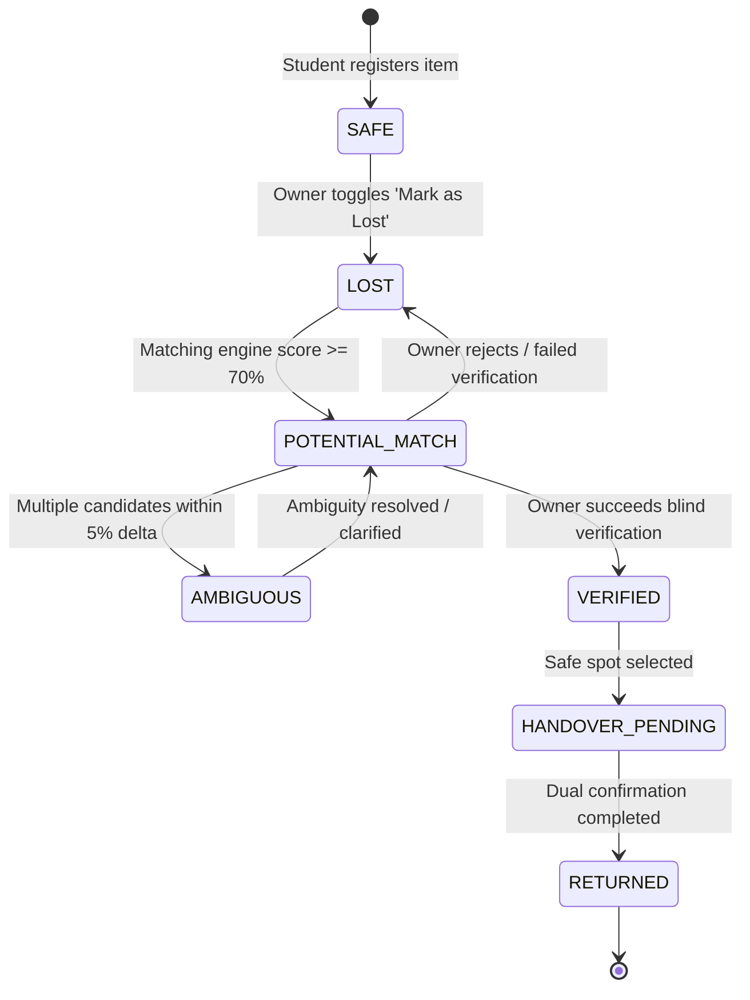
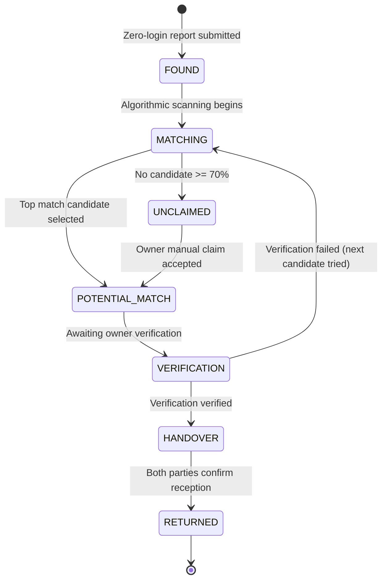
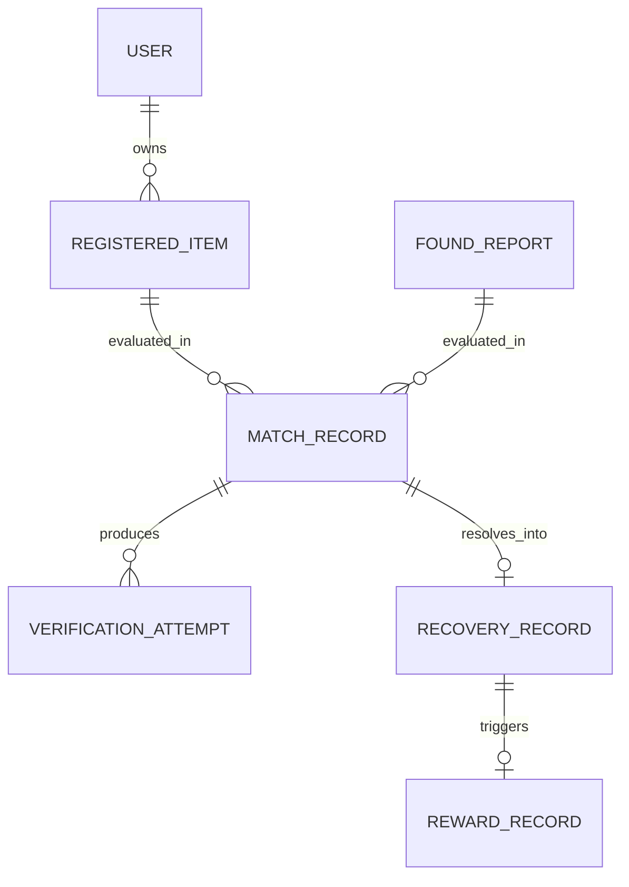

# State Machine & Data Models Reference

This document details the lifecycle state machines and data models governing items, found reports, verification attempts, and reward settlement in **KHOJ V1.5**.

---

## 1. Item Lifecycle State Machine

A student's registered item moves through the following progression:

### State Definitions

| State | Description | Permitted Actions |
| :--- | :--- | :--- |
| `safe` | Valuables are safe in the owner's possession. | Edit details, mark lost. |
| `lost` | The item is missing; actively evaluated against incoming found reports. | Edit last-seen location, view public gallery. |
| `potential_match` | An incoming found report matched with confidence $\ge 70\%$. | Review challenge question at `/verify/[id]`. |
| `ambiguous` | Multiple registered items closely match the same found report. | Await clarification or submit extra distinguishing proof. |
| `verified` | The owner confirmed identity via unique detail verification. | Coordinate handover at `/recovery/[id]`. |
| `handover_pending` | Handover location selected; awaiting physical exchange. | Owner & finder confirm reception. |
| `returned` | Handover confirmed by both parties; recovery completed. | Optional ₹20 micro-reward prompted. |

---

## 2. Found Report State Machine

A finder's report progresses independently until bound to an active match:

---

## 3. Entity Relationships

---

## 4. Schema Dictionary

### `RegisteredItem`
* **`id`** (`string`): Unique identifier (e.g. `item-101`).
* **`ownerEmail`** (`string`): Official college email (`student@campus.edu`).
* **`ownerName`** (`string`): Full name of the owner.
* **`category`** (`ItemCategory`): *Earbuds, Phone, Laptop, Charger, Bag, Watch, Water Bottle, ID Card, Keys, Calculator, Tablet, Other*.
* **`brand`** (`string`): Manufacturer name (e.g. *Sony*, *Apple*, *Milton*).
* **`model`** (`string`): Model designation (e.g. *WH-1000XM4*).
* **`colour`** (`string`): Primary visual color.
* **`unique_detail`** (`string`): **Crucial:** Private distinguishing characteristic (e.g., *"Small dent on hinge and Snoopy sticker"*). Kept confidential from finders.
* **`photos`** (`string[]`): URLs or Base64 data of registered images.
* **`status`** (`ItemStatus`): Current lifecycle state.
* **`lost_details`** (`object`): Last seen location, timestamp, and optional contextual notes.

### `FoundReport`
* **`id`** (`string`): Public reference ID (e.g. `KJ-4821`).
* **`image_url`** (`string`): Clear photo of found item taken by finder.
* **`detail_image_url`** (`string`, optional): Close-up photo of any marks/details.
* **`location`** (`string`): Specific campus building / area where spotted.
* **`finder_phone`** (`string`, optional): For SMS/WhatsApp notification updates.
* **`finder_upi`** (`string`, optional): UPI ID for optional ₹20 thank-you reward.
* **`rough_description`** (`string`, optional): Brief finder commentary.
* **`status`** (`string`): Status of the report.

### `MatchRecord`
* **`id`** (`string`): Unique match ID.
* **`found_report_id`** (`string`): Reference to `FoundReport`.
* **`item_id`** (`string`): Reference to `RegisteredItem`.
* **`score`** (`number`): Aggregate confidence score ($0 - 100$).
* **`visual_score`** (`number`): Visual heuristic score ($0 - 100$).
* **`unique_detail_score`** (`number`): Distinguishing detail score ($0 - 100$).
* **`context_score`** (`number`): Proximity and metadata score ($0 - 100$).
* **`rank`** (`number`): Priority rank among multiple candidates ($1, 2, 3$).
* **`source`** (`'ai_match' | 'manual_claim'`): How the match was initiated.

### `RecoveryRecord`
* **`id`** (`string`): Unique recovery ID.
* **`match_id`** (`string`): Associated match.
* **`found_report_id`** (`string`): Associated found item.
* **`owner_confirmed`** (`boolean`): True once owner presses confirm.
* **`finder_confirmed`** (`boolean`): True once finder presses confirm.
* **`handover_point`** (`string`): Designated campus spot (e.g. *Central Library Desk*).
* **`status`** (`'HANDOVER' | 'RETURNED'`): Completion status.

### `RewardRecord`
* **`id`** (`string`): Unique reward tracking ID.
* **`recovery_id`** (`string`): Linked recovery event.
* **`amount`** (`number`): Flat ₹20 per V1.5 specifications.
* **`finder_upi`** (`string`): Payee VPA.
* **`status`** (`'NOT_OFFERED' | 'OFFERED' | 'SKIPPED' | 'PENDING' | 'PAID'`): UPI settlement state machine.
