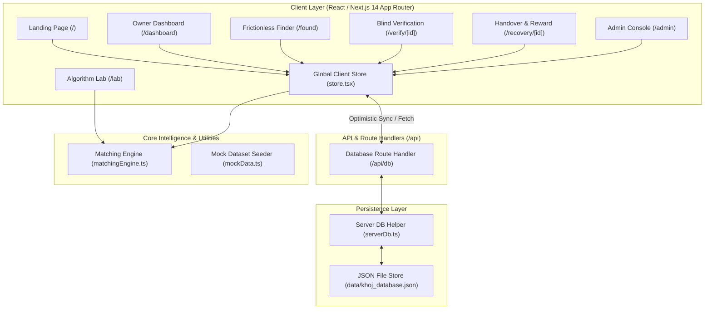

# System Overview & Architecture

This document describes the high-level software architecture, data flow, component hierarchy, and synchronization model of the **KHOJ V1.5** campus platform.

---

## 1. High-Level Architecture Diagram



---

## 2. Directory Structure

The project follows standard Next.js 14 App Router conventions:

```text
khoj/
├── data/
│   └── khoj_database.json          # Persistent file-based JSON database
├── docs/                           # Documentation suite
├── src/
│   ├── app/
│   │   ├── admin/                  # Proctor & campus administrator portal
│   │   ├── api/
│   │   │   └── db/route.ts         # Serverless endpoint reading/writing JSON store
│   │   ├── dashboard/              # Student registered item dashboard & status toggle
│   │   ├── found/                  # Zero-login frictionless found report flow
│   │   ├── lab/                    # Real-time matching algorithm simulation bench
│   │   ├── recovery/[id]/          # Handover spot selector & dual return confirmation
│   │   ├── unclaimed/              # Public gallery of un-matched campus items
│   │   ├── verify/[id]/            # Blind verification challenge page for owners
│   │   ├── layout.tsx              # Root HTML wrapper, CSS tokens & Navbar mount
│   │   └── page.tsx                # Landing / hero page with live campus metrics
│   ├── components/
│   │   ├── Navbar.tsx              # Dynamic navigation bar with active case counters
│   │   └── Toast.tsx               # Contextual micro-feedback toast manager
│   ├── lib/
│   │   ├── matchingEngine.ts       # Multi-signal matching algorithm
│   │   ├── mockData.ts             # Pre-configured campus test cases
│   │   ├── serverDb.ts             # Node.js fs-backed atomic reader/writer
│   │   └── store.tsx               # React Context providing optimistic client state
│   ├── styles/                     # Supplementary CSS styling rules
│   └── types/
│       └── index.ts                # TypeScript domain models and interfaces
├── KHOJ_V1.5_PRD.md                # Canonical PRD
└── package.json
```

---

## 3. Client-Server Synchronization Pattern

KHOJ combines client-side reactivity with server-side JSON persistence:

1. **Optimistic Updates:**  
   When a user creates a report, marks an item lost, or confirms a handover, the `useKhojStore()` React context in [`src/lib/store.tsx`](file:///c:/Users/Mannuuu/Desktop/khoj/src/lib/store.tsx) immediately mutates the in-memory React state, delivering instant UI feedback.
2. **Asynchronous Persistence:**  
   Simultaneously, the store sends an asynchronous `POST` or `PUT` request to `/api/db`.
3. **Atomic File Storage:**  
   [`src/lib/serverDb.ts`](file:///c:/Users/Mannuuu/Desktop/khoj/src/lib/serverDb.ts) uses Node's filesystem module to read and write to `data/khoj_database.json`. If the file does not exist, it automatically initializes with default schema collections.

---

## 4. UI Design System & CSS Variables

KHOJ enforces an artisanal dark luxury aesthetic without relying on external CSS frameworks. The design system is established in `src/app/layout.tsx` using CSS custom properties:

```css
:root {
  --bg-primary: #0a0b0e;
  --bg-secondary: #12141a;
  --bg-card: rgba(22, 25, 34, 0.7);
  --card-border: rgba(255, 255, 255, 0.08);
  --card-border-hover: rgba(99, 102, 241, 0.35);
  --accent: #6366f1;
  --accent-light: #818cf8;
  --accent-gradient: linear-gradient(135deg, #6366f1, #a855f7);
  --text-primary: #f8fafc;
  --text-secondary: #94a3b8;
  --text-muted: #64748b;
  --success: #10b981;
  --warning: #f59e0b;
  --danger: #ef4444;
  --glass-blur: blur(16px);
}
```

Key aesthetic features:
* **Glassmorphic Cards:** Translucent dark backgrounds with backdrop filters and fine subtle borders.
* **Micro-Interactions:** Smooth CSS transitions on hover, focus states, and button presses.
* **Fluid Layouts:** Responsive flexbox and CSS grids that work seamlessly across desktop and mobile screens.
