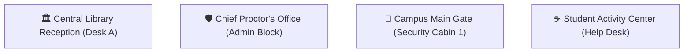

# Campus Administration & Safe Handover SOP

This document provides the standard operating procedures (SOP) for campus proctors, security personnel, and library reception desks operating the **KHOJ** platform.

---

## 1. Approved Campus Handover Safe Zones

To ensure safety and dispute prevention, in-person item handovers must take place at one of the four designated campus verification spots:



### Safety Rules:
1. **Never conduct handovers in unmonitored or isolated areas (e.g., parking basements, off-campus roads).**
2. In cases where the finder prefers not to meet the owner, the finder can deposit the item at the **Central Library Reception**, where the proctor/librarian logs physical custody.

---

## 2. Proctor Admin Portal Guide (`/admin`)

Campus administrators access the console at:
```text
http://localhost:3000/admin
```

### Key Administrative Capabilities:
* **Real-Time Recovery Metrics:** Live tracking of registered items, active lost items, recovery percentage, and average recovery turnaround time.
* **Ambiguity Resolution Queue:** View items where the matching engine detected multiple owners with identical scores ($\Delta S \le 5\%$).
* **Dispute Handling:** Reopen closed cases or re-assign matched candidates when a false verification is reported.
* **Custody Logging:** Mark items as *"Held at Library Desk"* or *"Released to Owner"*.

---

## 3. Dual-Confirmation Protocol

To avoid situations where one party claims an item was handed over while the other denies it:

```text
[Owner Screen: /recovery/KJ-4821]           [Finder Screen: /recovery/KJ-4821]
         ↓                                           ↓
  [ Confirm Received ]                       [ Confirm Handed Over ]
         ↓                                           ↓
         └─────────────► KHOJ SERVER ◄───────────────┘
                               ↓
                 Status: RETURNED (Settled)
```

1. **Owner Confirmation:** The owner visually inspects the item in person and clicks **"Confirm Received"**.
2. **Finder Confirmation:** The finder confirms they have passed the item to the owner and clicks **"Confirm Handed Over"**.
3. **Automated Completion:** Only when **both** parties have confirmed does the system mark the status as `RETURNED`.

---

## 4. Unclaimed Property Retention Policy

Items in the public unclaimed repository (`/unclaimed`) follow a strict 30-day lifecycle:

| Period | Status | Action Required |
| :--- | :--- | :--- |
| **Days 1 – 7** | Active Unclaimed | Displayed prominently in `/unclaimed` gallery; matching engine continuously evaluates new registrations. |
| **Days 8 – 21** | Second Notice | Automated campus email digest sent to student body featuring thumbnail photos. |
| **Days 22 – 30** | Final Notice | Item held in secure proctor lockers. Last call for student claims. |
| **Day 31+** | Disposal / Donation | Unclaimed low-value items (bottles, umbrellas) are donated or recycled. Electronics are archived for semester-end auction by the student council. |
