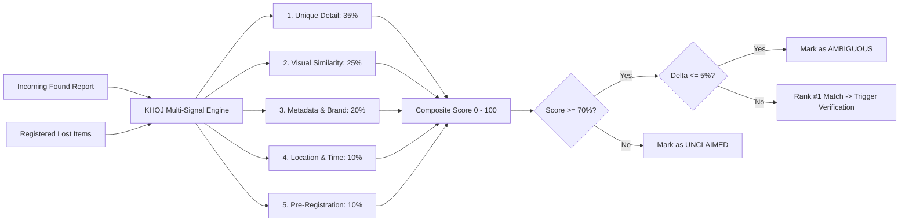

# Matching Engine Technical Specification

This document provides the mathematical and algorithmic specification of the **KHOJ Multi-Signal Matching Engine**, implemented in [`src/lib/matchingEngine.ts`](file:///c:/Users/Mannuuu/Desktop/khoj/src/lib/matchingEngine.ts).

---

## 1. Engine Objective

In a campus environment, standard metadata (e.g., *"Black Apple AirPods"*) is overwhelmingly ambiguous because dozens of students own identical models. The KHOJ matching engine solves this through a **multi-signal heuristic evaluation** that heavily weights distinguishing marks (unique details) and pre-loss registration over generic item characteristics.

---

## 2. Multi-Signal Weighting Matrix

The composite match score $S \in [0, 100]$ is computed as:

$$S = 100 \times \left( 0.35 \cdot s_{\text{unique}} + 0.25 \cdot s_{\text{visual}} + 0.20 \cdot s_{\text{metadata}} + 0.10 \cdot s_{\text{location}} + 0.10 \cdot s_{\text{precedence}} \right)$$

### Component Formulations

#### 1. Unique Detail Similarity ($s_{\text{unique}} \in [0.0, 1.0]$) — **Weight: 35%**
Evaluates whether distinguishing marks specified by the owner match the finder's rough description or detail photos:
* If finder provided a detail close-up photo: $+0.35$ photo bonus.
* Word token overlap calculated via Jaccard intersection with fuzzy 4-prefix character matching:
  $$\text{Jaccard}(W_1, W_2) = \frac{|W_1 \cap W_2|}{|W_1 \cup W_2|}$$
* Base detail score:
  $$s_{\text{unique}} = \min(1.0, 0.70 \cdot \text{TextSimilarity} + \text{PhotoBonus})$$

#### 2. Visual / Semantic Similarity ($s_{\text{visual}} \in [0.0, 1.0]$) — **Weight: 25%**
* Base score: $0.50$.
* If finder's category guess equals registered category: $+0.30$.
* If finder's description mentions registered brand: $+0.15$.
* If description mentions registered colour: $+0.10$.
* If description mentions exact registered model: $+0.15$.
* Clamped: $\min(1.0, s_{\text{visual}})$.

#### 3. Metadata & Category Match ($s_{\text{metadata}} \in [0.0, 1.0]$) — **Weight: 20%**
* Strict Category Match: Required baseline. If categories strictly conflict, metadata score is penalized to $0.20$.
* Brand & Model Containment: Evaluates manufacturer naming equivalence.

#### 4. Location & Time Proximity ($s_{\text{location}} \in [0.0, 1.0]$) — **Weight: 10%**
* Matches campus building zones (e.g., *"Central Library"*, *"CS Block"*, *"Cafeteria"*).
* Exact/substring campus zone match: $0.95$.
* Unspecified or distinct building zones: $0.40$.

#### 5. Registration Precedence ($s_{\text{precedence}} \in [0.0, 1.0]$) — **Weight: 10%**
* Items registered **before** the found timestamp receive $1.00$ (high confidence, eliminates retroactive fraudulent claims).
* Items registered **after** the found report was filed receive $0.60$ (lower precedence).

---

## 3. Decision & Routing Rules

1. **Definite Candidate ($S \ge 70\%$):**
   * The candidate with the highest composite score is set as `active_match_id`.
   * A blind verification challenge is generated for the owner.
2. **Ambiguity Flagging ($\Delta S \le 5\%$):**
   * If Candidate #1 ($S_1$) and Candidate #2 ($S_2$) satisfy:
     $$|S_1 - S_2| \le 5\%$$
     both candidates are flagged with `isAmbiguous = true`.
   * The system prompts owners for clarifying details before proceeding to physical handover.
3. **No Match ($S < 70\%$):**
   * The found report remains in the public unclaimed repository (`/unclaimed`), where students can browse and manually request a verification review.

---

## 4. Interactive Simulation Lab (`/lab`)

Developers can experiment with live algorithm parameters at `/lab`:
* Real-time sliders allow tweaking each coefficient ($w_{\text{unique}}, w_{\text{visual}}, w_{\text{metadata}}, w_{\text{location}}, w_{\text{precedence}}$).
* Benchmark suites test corner cases (e.g., identical black water bottles, AirPods cases with distinct decals, calculators with engraved initials).

---

## 5. V2.0 Machine Learning Roadmap

| Component | V1.5 (Current Implementation) | V2.0 (Target Architecture) |
| :--- | :--- | :--- |
| **Visual Matching** | Simulated heuristics & keyword extraction | **OpenAI CLIP / ViT** embeddings generated at upload. |
| **Vector Search** | In-memory JavaScript array iteration | **Pinecone / pgvector** cosine similarity search ($k$-NN). |
| **Unique Marks** | String token overlaps | Multi-modal visual question answering (VQA) using Gemini Flash. |
| **OCR** | Manual reading by proctor | Automated on-device OCR for student ID cards and serial numbers. |
