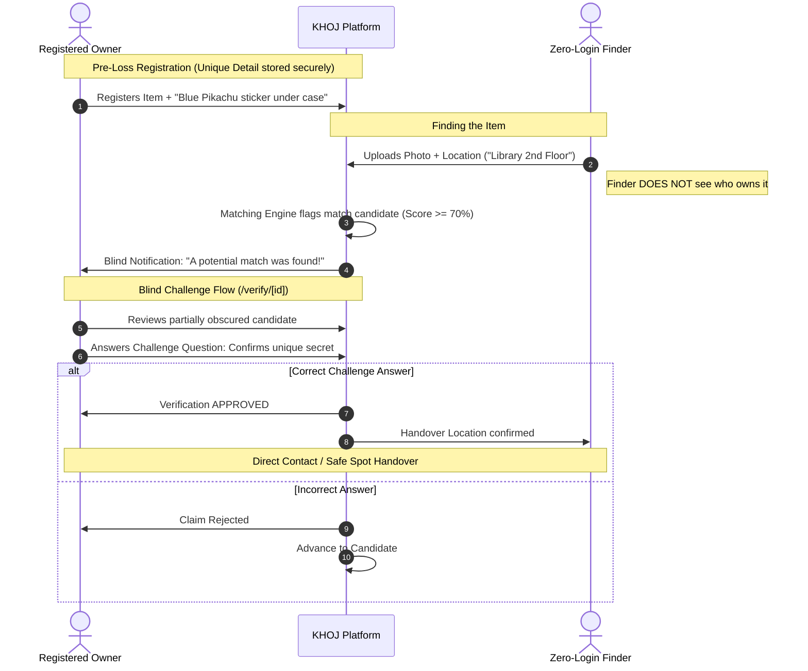

# Blind Ownership Verification & Security Protocol

This document outlines the security architecture, fraud prevention mechanisms, and data privacy safeguards implemented in **KHOJ V1.5**.

---

## 1. The Core Problem in Traditional Lost & Found

Traditional lost-and-found portals suffer from a critical flaw: **asymmetric disclosure**.
1. When a finder posts a detailed picture of an item (e.g., *"Found black wallet with ₹500 at library"*), bad actors can visually inspect the photo and fabricate a claim.
2. Inquiring finders often ask, *"Is this your item?"*, prompting bad actors to answer *"Yes"*, resulting in theft and disputes.

---

## 2. KHOJ's Solution: Blind Verification

KHOJ eliminates fraudulent claims by keeping distinguishing characteristics private until ownership is algorithmically verified:

---

## 3. Privacy Safeguards

### A. Zero-Exposure for Finders
Finders never see:
* The student's full name, roll number, or college department.
* The owner's phone number until dual confirmation is unlocked.
* The pre-registered unique detail text.

### B. Minimal Exposure for Owners
Until an owner confirms they lost an item at that location and accepts the candidate preview, finder contact details remain masked.

### C. Micro-Reward Separation
The ₹20 micro-reward:
* Does **not** require credit card numbers or bank credentials.
* Operates via standard UPI VPAs (e.g. `finder@okhdfcbank`).
* Is processed peer-to-peer or prompted optionally, ensuring recovery is never held hostage for payment.

---

## 4. Anti-Fraud & Abuse Defenses

| Threat Vector | Mitigation Mechanism |
| :--- | :--- |
| **Mass Claim Flooding** | Maximum 3 active verification attempts per student account every 24 hours. |
| **Retroactive Registration** | Registered items created **after** a found report was posted receive lower precedence in the matching engine ($1.00 \to 0.60$). |
| **Ambiguity Collisions** | When multiple identical items (e.g., 5 identical black HydroFlask bottles) are lost, the system flags the case as `AMBIGUOUS` and routes it to the Proctor Admin Console (`/admin`) for manual inspection. |
| **False Return Confirmations** | Handover completion requires **dual confirmation**: both the owner and finder must confirm physical transfer on their devices. |
